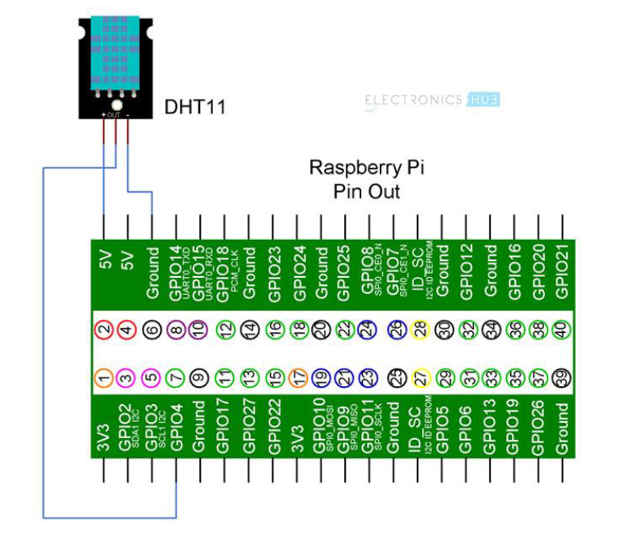

# ENDG 510 L01 Lab One (Fall 2023)
The purpose of this lab is to demonstrate sensor data acquisition in Cyber Physical Systems (CPS) and the data collection process and its subsequent storage for future analysis.

## Authors:
* John Santos
* Kushal Gadhiya
* Ben Byrne

# Required Components
* IoT Sensors DHT11 (i.e., temperature and humidity sensors)
* Stick PC (i.e., raspberry pi 4)
* Jump wires (female to female)
* Wi-Fi router/connectivity.
* Edge server (i.e., Laptop) (You need to bring your own laptop for the experiment)

# Steps
1) Establish the physical connections to the raspberry pi such as power, mouse, keyboard, and a monitor.

2) Download the [64-bit Raspbian Image](https://www.raspberrypi.com/software/) to the raspberry pi.

3) Connect the DHT11 sensor to the raspberry pi following the image reference below.



4) Run the following commands on the raspberry pi.
```shell
sudo apt-get update
```

```shell
sudo apt-get upgrade
```

5) Install git in the raspberry pi using the command below.
```shell
sudo apt-get install git-core
```

6) Install the Adafruit DHT11 library using the command below.
```shell
git clone https://github.com/adafruit/Adafruit_Python_DHT.git
```

7) Setup the Adafruit library by following the commands below.

```shell
cd Adafruit_Python_DHT
```

```shell
sudo apt-get install build-essential python-dev-is-python3
```

```shell
sudo python setup.py install
```

5) Following the successful connection and data collection, the next step is to establish a wireless
communication link, preferably utilizing Wi-Fi technology, with the nearest available edge server.
The edge server, for your convenience, can be any suitable computing device such as a laptop or
desktop computer. Once the wireless connection has been effectively configured, your primary
objective is to seamlessly transmit the gathered sensor data from the Raspberry Pi to the
designated edge server. To accomplish this, make use of socket programming techniques to
facilitate the wireless data transfer.

6) Upon the successful transmission of the data to the edge server, the final phases of the task involve
two critical actions. Firstly, ensure that the received data is stored on the edge server for future
reference and analysis. Secondly, simultaneously display the received data in a real-time manner.


